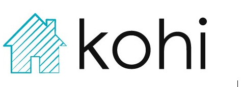

# kohi-hci

Kohi is a mobile application for controlling your home. New homeowners have so much to worry about in their new home. Automating as much as possible allows homeowners to focus on the important aspects of owning a property; making it yours. Kohi gives users control of a variety of third party health, security, and environment applications in a single convenient user interface.
#Link to the Figma prototype: https://www.figma.com/community/file/1166443504982195800
